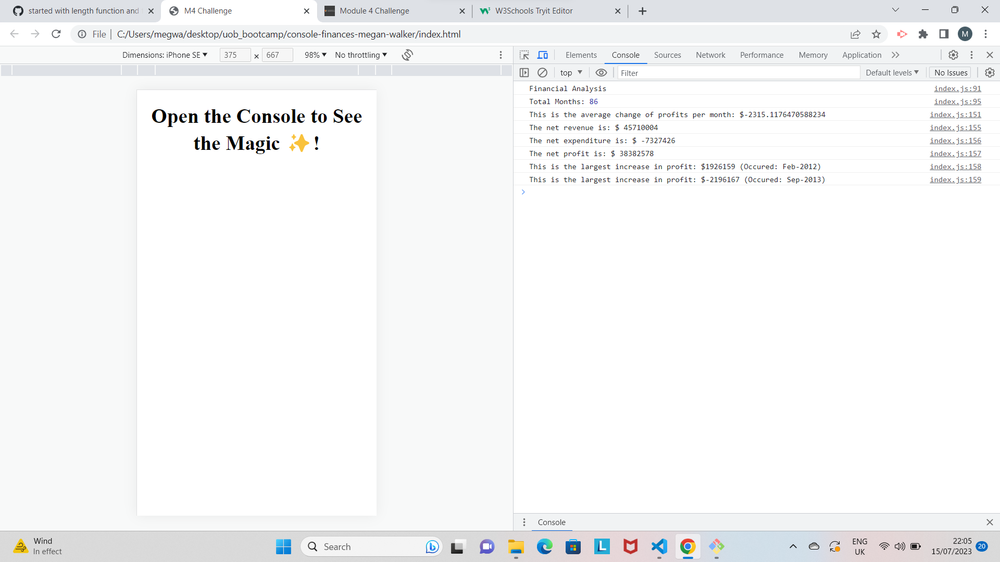

# Console-Finances-Megan-Walker
A JavaScript Project to create a dataset for financial records.

Using Javascript to code through an array fo financial data to find:

-The total number of months
-The net profit
-The average change in profits
-The greatest inrease/decrease of profits over the period

This is a prohect to become familiar with JavaScript functions such as for loops and if/else statements. It also has helped me to become more familiar with basic JavaScript syntax and how to think logically and use the console to check my work.

https://megwalkerlange.github.io/Console-Finances-Megan-Walker/

